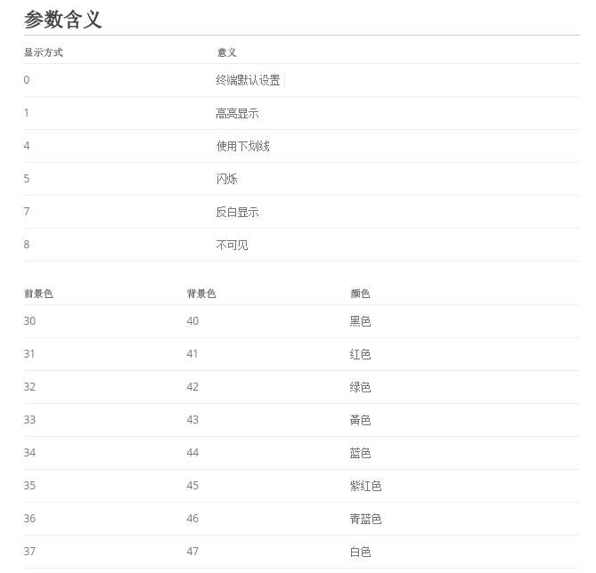
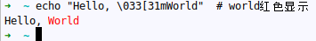
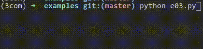
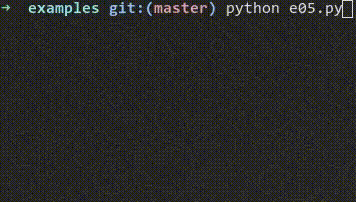
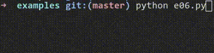
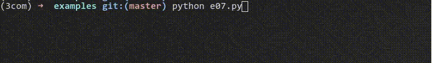

第一篇：程序输出
---------------------------------------------------------------------------------------------------

1.1 如何突出突出重点
~~~~~~~~~~~~~~~~~~~~~~~~~~~~~~~~~~~~~~~~~~~~~~~~~~~~~~~~~~~~~~~~~~~~~~~~~~~~~~~~~~~~~~~~~~~~~~~~~~~

相信大家都会在程序中使用print来输出程序运行状态等信息，有的人只打印重点信息导致除了自己谁也看不懂输出是啥意思，
这会导致大家想要用这个程序还要去看源代码，有的人打印的太多导致还没找到重点信息，下一条打印都打印出来了。

有了这个疑问我就思考，能不能使用颜色来醒目地标出重点信息，Google一下发现先贤们早就为我们想好了，基本上所有的终
端模拟器都支持这样做。

.. code-block:: bash

    \033[显示方式;前景色;背景色m

其中 **\\033** 是ESC健的八进制， **\\033[** 即告诉终端后面是设置颜色的参数，显示方式，前景色，背景色均是数字。

注：显示方式、前景色、背景色可以指定一到多个。

例如：

.. code-block:: bash

    echo "Hello, \033[31mWorld"  # world红色显示

如果使用Python的话：

下载 :download:`exmaples/e00.py <examples/e00.py>`

.. literalinclude:: examples/e00.py
    :language: python

有人说这也太麻烦了，每次我要打印一个字符串时还要 **\\033[** 一大堆，每次还要看文档，哪个值对应哪个颜色，我宁愿不显示颜色。

那么，恭喜你，你已经具备的科学家的素质。

主流语言都有对这个方式的包装，以Python为例，就有很多:

1. colorama
2. termcolor
3. ...

termcolor是一个比较简单的实现：

下载 :download:`exmaples/e01.py <examples/e01.py>`

.. literalinclude:: examples/e01.py
    :language: python

1.2 如何实现进度条
~~~~~~~~~~~~~~~~~~~~~~~~~~~~~~~~~~~~~~~~~~~~~~~~~~~~~~~~~~~~~~~~~~~~~~~~~~~~~~~~~~~~~~~~~~~~~~~~~~~

有时候一个任务特别耗时，用户需要知道到底这个程序运行到了什么状态，或者用户需要知道这个程序死掉了还是在运行，这时使用
进度条是非常有必要的。

如何实现进度条呢？

原理是输出字符串时，不输出换行符，下次输出直接跳到行首继续输出。这里面跳到行首是最重要的，一般是 **\\r** 来完成。

也就是说，当一个字符串里面包含 **\\r** 时，**\\r** 后面的字符其实是跳到行首输出的。这样会把 **\\r** 前面的字符
盖掉。

下载 :download:`exmaples/e03.py <examples/e03.py>`

.. literalinclude:: examples/e03.py
    :language: python

有些聪明的读者可能发现，当新的字符串比之前短的时候会出现问题。其实是因为已经被flush出去的字符并不会主动清空，所以
只有新写入的被修改了。针对这点我目前的解决方案是先输出一波空格把之前的字符串冲掉然后重新写：

下载 :download:`exmaples/e04.py <examples/e04.py>`

.. literalinclude:: examples/e04.py
    :language: python

现在又有个问题，我还想print，但是进度条随着print的内容移动，一直保证其在最下方，看例子:

下载 :download:`exmaples/e05.py <examples/e05.py>`

.. literalinclude:: examples/e05.py
    :language: python

为什么进度栏会一直在最下面，因为print打印出了换行符，下次打印进度栏的时候自然到最下面去了。

一个真正的进度条:

下载 :download:`exmaples/e06.py <examples/e06.py>`

.. literalinclude:: examples/e06.py
    :language: python

看到这，有人又要问了，这个还是有点麻烦，有没有简便的方法，其实还真有。

拿Python来说有个简单的库: progressbar2，可以实现。

安装progressbar2：

.. code-block:: bash

    pip install progressbar2

例如:

下载 :download:`exmaples/e07.py <examples/e07.py>`

.. literalinclude:: examples/e07.py
    :language: python

咋样？是不是很清爽！
